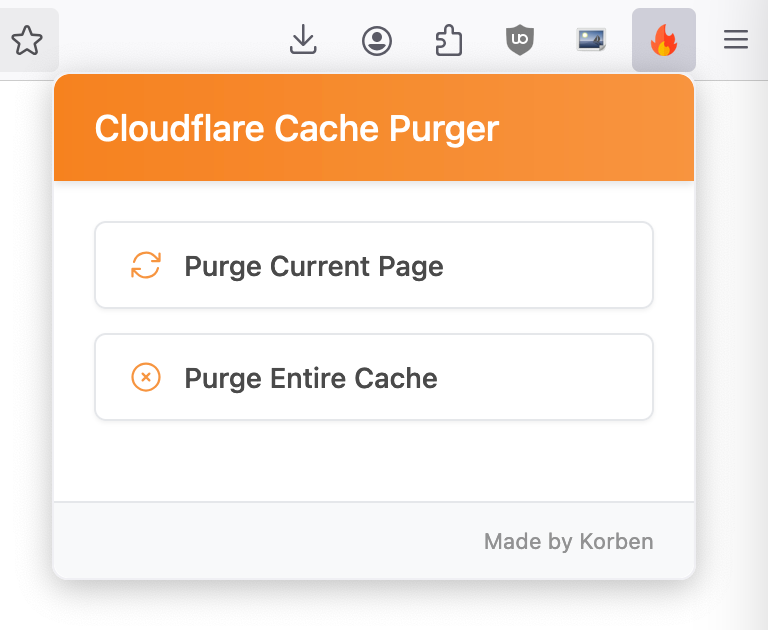
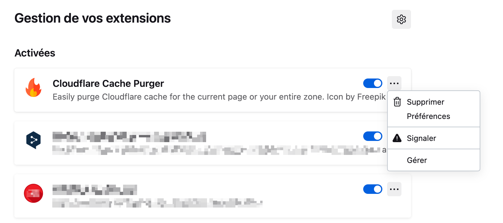
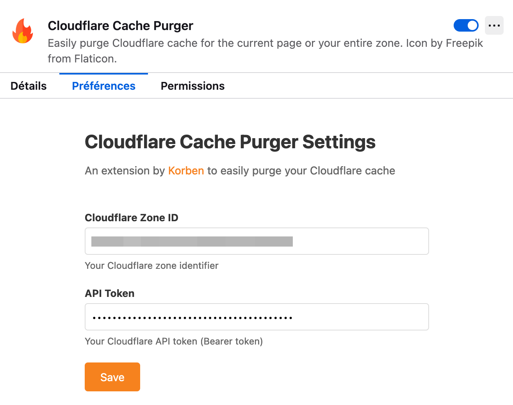
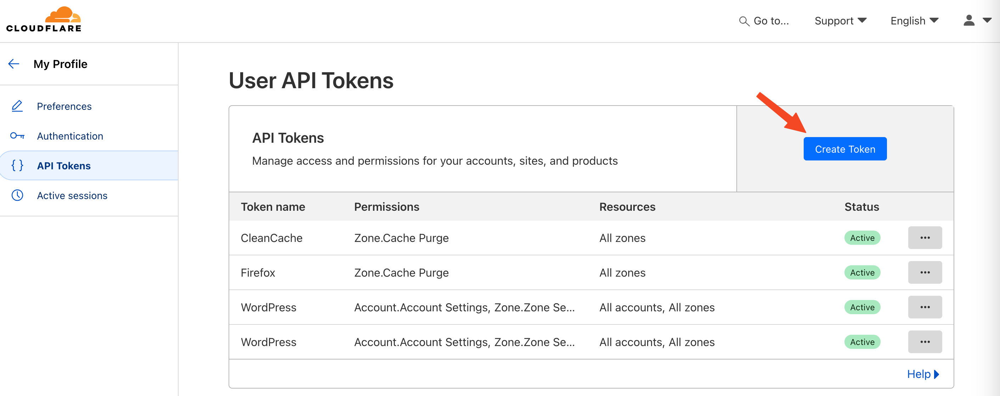
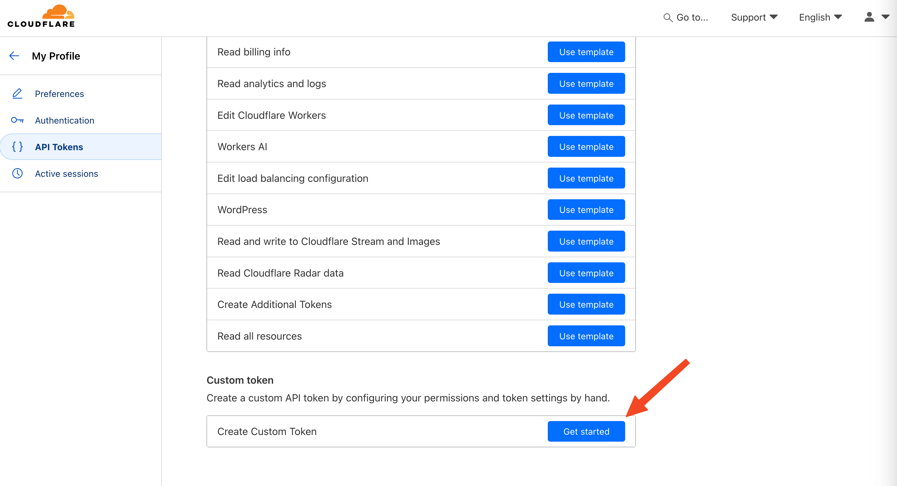
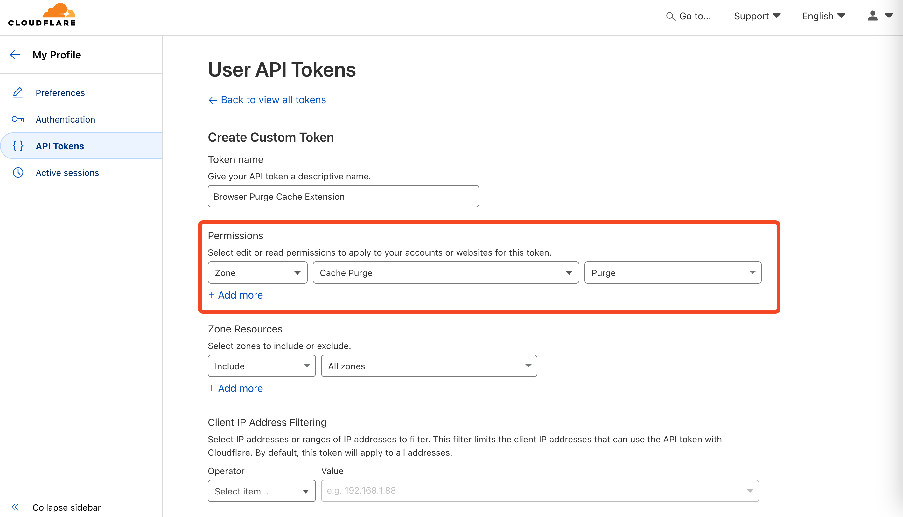
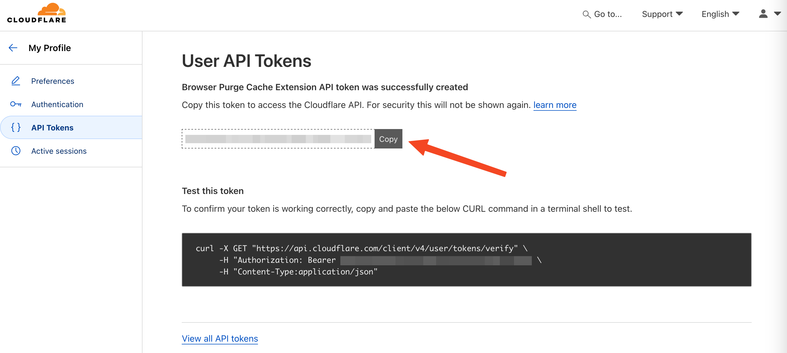

# Cloudflare Cache Purger for Firefox

A Firefox extension that allows you to easily purge Cloudflare cache for the current page or your entire zone.

## Features

- Purge cache for the currently viewed page
- Purge entire Cloudflare cache
- Simple and intuitive interface
- Easy Cloudflare credentials configuration
- Confirmation messages for each action

## Installation

1. Install the extension from [addons.mozilla.org](https://addons.mozilla.org)
2. Click on the extension icon in the toolbar
3. Go to the extension settings

4. Configure your Cloudflare credentials:
   - Cloudflare Zone ID
   - API Token (Bearer token)

## How to get your credentials

1. Cloudflare Zone ID:
   - Log in to your Cloudflare dashboard
   - Select your domain
   - The Zone ID can be found in the right sidebar

2. API Token:
   - Go to "My Profile > API Tokens" on Cloudflare
   
   
   - Create a new token with "Zone.Cache Purge" permissions
   
   
   
   - Copy the generated token
   

## Usage

1. To purge the current page cache:
   - Navigate to the desired page
   - Click the extension icon
   - Click "Purge current page"

2. To purge the entire cache:
   - Click the extension icon
   - Click "Purge entire cache"

## Support

For any questions or issues:
- Open an issue on GitHub
- Contact the author at korben.info

## Privacy

This extension:
- Does not collect any personal data
- Stores your Cloudflare credentials locally in your browser
- Only communicates with the Cloudflare API

## License

MIT License

## Credits

- Extension author: Korben
- Visit [Korben.info](https://korben.info)
- Extension icon: [Fire icons created by Freepik - Flaticon](https://www.flaticon.com/free-icons/fire)
